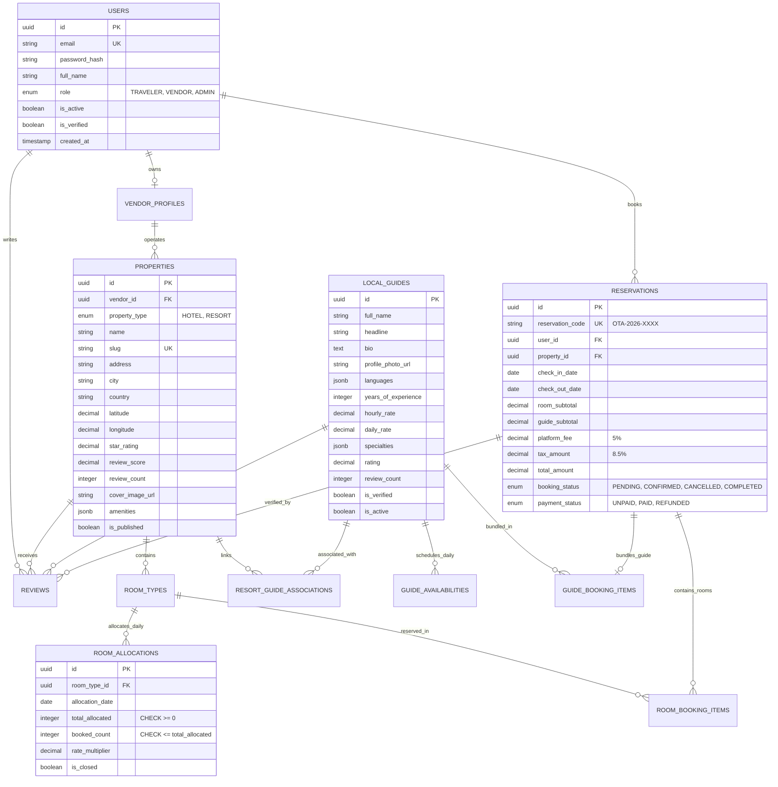
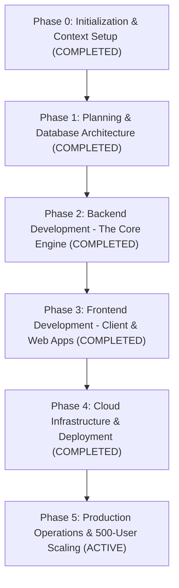
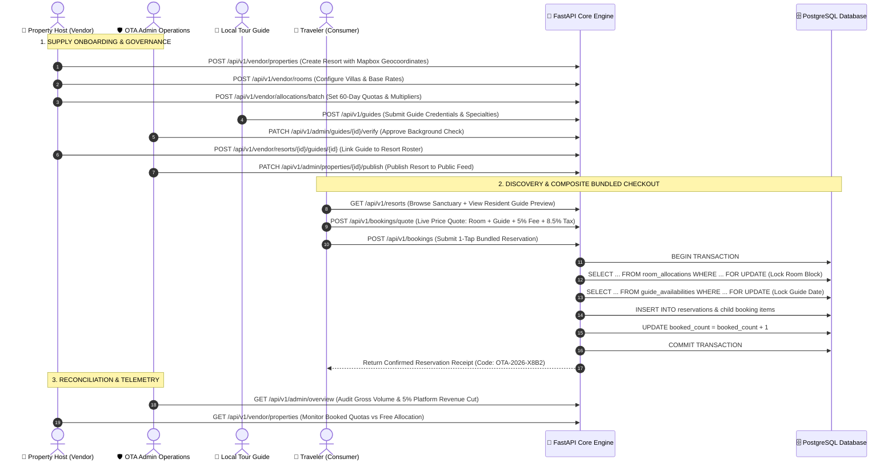

# 🧠 PLAN-E: THE MASTERMIND BLUEPRINT
### Comprehensive End-to-End System Architecture, Business Mechanics, Lifecycle Roadmap & Production CRUD Operations Guide

---

```
                                      PLAN-E ECOSYSTEM TOPOLOGY
┌───────────────────────────────────────────────────────────────────────────────────────────────────────┐
│                                          CLIENT INTERFACES                                            │
├──────────────────────────────┬────────────────────────────────────┬───────────────────────────────────┤
│ 📱 TRAVELER CONSUMER APP     │ 🏨 VENDOR MANAGEMENT PORTAL        │ 🛡️ ADMIN OPERATIONS DASHBOARD     │
│   (Flutter Mobile & Web)     │      (Lightweight Web Portal)      │      (Lightweight Web Portal)     │
│ • City Hotels (Speed/Nearby) │ • Room Allocation Grid Matrix      │ • Real-time Gross Volume & 5% Cut │
│ • Resorts & Sanctuaries      │ • Dynamic Rate Multipliers (Peak)  │ • Local Guide Background Vetting  │
│ • Local Guide Bundling Sheet │ • Guide Roster Linker              │ • Property Publishing Oversight   │
│ • Atomic 1-Tap Checkout      │ • Host Booking Reconciliation      │ • System Health & Audit Telemetry │
└──────────────┬───────────────┴─────────────────┬──────────────────┴───────────────────┬───────────────┘
               │                                 │                                      │
               └─────────────────────────────────┼──────────────────────────────────────┘
                                                 │ (HTTPS / REST JSON / JWT Auth)
                                                 ▼
┌───────────────────────────────────────────────────────────────────────────────────────────────────────┐
│                                 NGINX REVERSE PROXY & STATIC GATEWAY                                  │
│                                  (Port 80/443 • Gzip • Security Headers)                              │
└────────────────────────────────────────────────┬──────────────────────────────────────────────────────┘
                                                 │
                                                 ▼
┌───────────────────────────────────────────────────────────────────────────────────────────────────────┐
│                                     PYTHON FASTAPI CORE ENGINE                                        │
│                                      (Port 8000 • ASGI / uvloop)                                      │
├────────────────────────────────────────────────┬──────────────────────────────────────────────────────┤
│ 🏢 Hotel Service (/api/v1/hotels)              │ 🏝️ Resort Service (/api/v1/resorts)                   │
│ • High-velocity sub-50ms query path            │ • Rich media & experiential amenity filters          │
│ • Mapbox spatial bounding-box indexing         │ • Certified Resident Guide Roster preloading         │
├────────────────────────────────────────────────┴──────────────────────────────────────────────────────┤
│ 🔒 Booking & Allocation Engine (/api/v1/bookings)                                                     │
│ • Pre-checkout Price Quote calculator (/quote) with 5% platform fee & 8.5% lodging tax                │
│ • Pessimistic Row-Level Locking (SELECT ... FOR UPDATE) guaranteeing zero overbooking                 │
│ • Atomic calendar reservation for bundled Local Guides                                                │
└────────────────────────────────────────────────┬──────────────────────────────────────────────────────┘
                                                 │ (Async Connection Pool: 20 active / 10 overflow)
                                                 ▼
┌───────────────────────────────────────────────────────────────────────────────────────────────────────┐
│                                  POSTGRESQL 15 RELATIONAL DATABASE                                    │
│                                              (Port 5432)                                              │
│ • Custom ENUMs (UserRole, PropertyType, BookingStatus, PaymentStatus)                                 │
│ • Database Check Constraints (chk_booked_le_allocated, chk_guide_hourly_positive)                     │
│ • Spatial B-Tree indexes on (latitude, longitude) & Date indexes on (allocation_date)                 │
│ • Auto-recalculation triggers for ratings, review counts, and timestamps                              │
└───────────────────────────────────────────────────────────────────────────────────────────────────────┘
```

---

## 1. The Idea & Business Concept

### 1.1 The Vision
Plan-E is a next-generation Online Travel Agency (**OTA**) engineered to capture the high-margin experiential vacation market while maintaining hyper-efficient transactional performance for city hotel stays. 

Targeting an initial beta of **200 to 500 active travelers** and designed to scale to **50,000+ daily transactions**, the platform solves the core fragmentation problem plaguing existing OTAs (such as Expedia and Booking.com) which treat luxury vacation planning identical to transactional 1-night airport hotel bookings.

### 1.2 The Core Problem
* **Traditional OTAs Fail at Experiential Travel:** When travelers book a $600/night luxury coastal resort, they are left on their own to source, vet, schedule, and separately pay local tour guides, marine naturalists, or mountain guides.
* **Two-Way GDS Latency Spikes:** Traditional 3rd-party Global Distribution Systems (GDS) introduce multi-second API latency, brittle webhooks, and frequent race-condition overbookings during flash sales.

### 1.3 The Plan-E Innovation: Two Pillars

#### Pillar I: Strict Dual-Path User Journeys
The platform strictly separates the consumer experience into two distinct psychological flows:
1. **City Hotel Journey (Transactional Velocity):**
   * **Target:** Business travelers, short urban stays, transit overnights.
   * **Mechanics:** Sub-50ms search response, Mapbox proximity clustering, price-per-night sorting, and 1-click instant checkout.
2. **Resort Journey (Immersive Vacation + Certified Local Guide Bundling):**
   * **Target:** Vacationers, couples, luxury ecotourists, family retreats.
   * **Mechanics:** Cinematic hero visual galleries, sanctuary amenity tags, and **The Local Guide Bundling Feature**—allowing travelers to browse resident guides (identity, credentials, languages, specialties, daily/hourly rates) and bundle them directly into their room reservation in a single checkout.

#### Pillar II: The Vendor Allocation Inventory Model
Instead of relying on slow 3rd-party GDS syncing for the MVP/Beta stage, Plan-E implements the **Vendor Allocation Model**:
* Partner hotel and resort hosts allocate fixed room quotas directly into the Plan-E database matrix (`room_allocations`).
* When a booking occurs, database-level **Pessimistic Row-Level Locking** (`SELECT ... FOR UPDATE`) atomically checks and increments `booked_count`.
* Hard database check constraints (`CHECK (booked_count <= total_allocated)`) guarantee **100% mathematical zero-overbooking** with zero external API latency.

---

## 2. System & Database Architecture

### 2.1 Database Schema Design & Constraints

The relational schema is implemented in raw PostgreSQL DDL ([`backend/sql/schema.sql`](file:///home/kali/Desktop/Plan-E/backend/sql/schema.sql)) and mapped via SQLAlchemy 2.0 Async declarative models ([`backend/app/models/`](file:///home/kali/Desktop/Plan-E/backend/app/models/)).



### 2.2 Concurrency & Atomic Locking Mechanics
When a booking request arrives at `POST /api/v1/bookings`:
1. **Transaction Begin (`db.begin()`):** Opens an isolated database transaction.
2. **Allocation Lock:**
   ```sql
   SELECT id, total_allocated, booked_count 
   FROM room_allocations 
   WHERE room_type_id = :room_id 
     AND allocation_date BETWEEN :check_in AND :check_out_minus_1
   FOR UPDATE;
   ```
   * The database acquires exclusive row locks. Any other concurrent checkout must wait until this transaction completes.
   * The engine validates that `total_allocated - booked_count >= requested_rooms` for every single night.
   * Increments `booked_count += requested_rooms`.
3. **Guide Calendar Lock (If Local Guide is Bundled):**
   ```sql
   SELECT id, is_available, is_booked 
   FROM guide_availabilities 
   WHERE guide_id = :guide_id 
     AND availability_date = :service_date 
   FOR UPDATE;
   ```
   * Verifies `is_available = true AND is_booked = false`.
   * Sets `is_booked = true`.
4. **Parent Reservation Creation:** Writes to `reservations`, `room_booking_items`, and `guide_booking_items`.
5. **Transaction Commit (`await db.commit()`):** Atomically commits all changes and releases all locks simultaneously.

---

## 3. End-to-End Development Phasing & Execution History



### Phase Breakdown & Deliverables

#### Phase 0: Initialization & Context Retention
* **Goal:** Establish Single Source of Truth (SSOT) memory bank.
* **Deliverable:** Initialized [`PROJECT_KNOWLEDGE.md`](file:///home/kali/Desktop/Plan-E/PROJECT_KNOWLEDGE.md) with initial Architectural Decision Records (ADR-001 through ADR-005).

#### Phase 1: Planning & Database Architecture
* **Goal:** Design complete relational schema, custom constraints, and async models.
* **Deliverables:**
  * Raw PostgreSQL DDL with triggers and checks: [`backend/sql/schema.sql`](file:///home/kali/Desktop/Plan-E/backend/sql/schema.sql)
  * Comprehensive test seed data: [`backend/sql/seed.sql`](file:///home/kali/Desktop/Plan-E/backend/sql/seed.sql)
  * SQLAlchemy 2.0 Async declarative models: [`backend/app/models/`](file:///home/kali/Desktop/Plan-E/backend/app/models/)
  * Architecture documentation: [`docs/ER_DIAGRAM.md`](file:///home/kali/Desktop/Plan-E/docs/ER_DIAGRAM.md)

#### Phase 2: Backend Development - The Core Engine
* **Goal:** Build modular FastAPI engine, decoupled Hotel/Resort pipelines, and atomic booking service.
* **Deliverables:**
  * Pydantic v2 schemas: [`backend/app/schemas/`](file:///home/kali/Desktop/Plan-E/backend/app/schemas/)
  * Domain services (`HotelService`, `ResortService`, `GuideService`, `BookingService`, `VendorService`): [`backend/app/services/`](file:///home/kali/Desktop/Plan-E/backend/app/services/)
  * REST API Routers: [`backend/app/api/v1/endpoints/`](file:///home/kali/Desktop/Plan-E/backend/app/api/v1/endpoints/)
  * Automated Test Suite with in-memory async SQLite engine: [`backend/tests/`](file:///home/kali/Desktop/Plan-E/backend/tests/) (**10/10 Tests Passed**).

#### Phase 3: Frontend Development - Client & Web Portals
* **Goal:** Cross-platform consumer mobile app and dedicated vendor & admin web interfaces.
* **Deliverables:**
  * Flutter Native Mobile Application: [`mobile_app/`](file:///home/kali/Desktop/Plan-E/mobile_app/) (Theme, Models, State Providers, Mapbox View, Dual Search, Guide Bundling Sheet, Checkout).
  * Web-based Consumer Simulator: [`web_portal/consumer/index.html`](file:///home/kali/Desktop/Plan-E/web_portal/consumer/index.html).
  * Vendor Management Portal: [`web_portal/vendor/index.html`](file:///home/kali/Desktop/Plan-E/web_portal/vendor/index.html) (Allocation Grid Matrix & Guide Linker).
  * Admin Operations Dashboard: [`web_portal/admin/index.html`](file:///home/kali/Desktop/Plan-E/web_portal/admin/index.html) (Revenue 5% Telemetry & Guide Vetting Queue).
  * Master Ecosystem Launchpad Hub: [`web_portal/index.html`](file:///home/kali/Desktop/Plan-E/web_portal/index.html).

#### Phase 4: Cloud Infrastructure & Deployment
* **Goal:** Multi-stage production containerization and deployment scripts.
* **Deliverables:**
  * Multi-stage production Dockerfile: [`backend/Dockerfile`](file:///home/kali/Desktop/Plan-E/backend/Dockerfile).
  * Nginx reverse proxy configuration: [`nginx/nginx.conf`](file:///home/kali/Desktop/Plan-E/nginx/nginx.conf).
  * Orchestrated multi-container stack: [`docker-compose.yml`](file:///home/kali/Desktop/Plan-E/docker-compose.yml).
  * Environment templates: [`.env.example`](file:///home/kali/Desktop/Plan-E/.env.example) and [`.env`](file:///home/kali/Desktop/Plan-E/.env).
  * Automated bootstrap script: [`deploy.sh`](file:///home/kali/Desktop/Plan-E/deploy.sh).

---

## 4. The Master Production CRUD Lifecycle Matrix

This section provides the definitive, domain-by-domain operational guide for **How, Where, and Who** creates, reads, updates, and deletes (CRUD) every entity across the Plan-E ecosystem.
 ### 1. The Production CRUD Lifecycle Matrix

   Entity / Data Domain  |      CRUD Action      | Where it is Done at … | Permitted Role (RBAC) | Technical Workflow &…
  -----------------------|-----------------------|-----------------------|-----------------------|-----------------------
   🏨 Hotels & Resorts   |       C / U / D       | Vendor Portal         | Property Vendor       | Vendor fills property
   (Name, Description,   |                       | (/vendor) &           | (Host)                | onboarding wizard.
   Amenities, Policies,  |                       | POST/PATCH            |                       | Slug is auto-
   Star Rating)          |                       | /api/v1/vendor/proper |                       | generated; assets
                         |                       | ties                  |                       | stored in S3/CDN;
                         |                       |                       |                       | initial status set to
                         |                       |                       |                       | is_published: false
                         |                       |                       |                       | awaiting approval.
                         |   Publish / Verify    | Admin Dashboard       | OTA Admin Ops         | Admin audits business
                         |                       | (/admin) & PATCH      |                       | license, verifies
                         |                       | /api/v1/admin/propert |                       | photos/amenities, and
                         |                       | ies/{id}/publish      |                       | flips is_published:
                         |                       |                       |                       | true to make it
                         |                       |                       |                       | discoverable in the
                         |                       |                       |                       | search index.
                         |         Read          | Traveler Mobile / Web | Public / Travelers    | Cached read queries
                         |                       | App (/consumer) & GET |                       | separated by journey
                         |                       | /api/v1/hotels, GET   |                       | type (Hotels: fast
                         |                       | /api/v1/resorts       |                       | velocity sorting;
                         |                       |                       |                       | Resorts: rich media
                         |                       |                       |                       | aggregation).
   🛏️ Room Types & Base  |       C / U / D       | Vendor Portal         | Property Vendor       | Host configures room
   Pricing (Villa/Suite, |                       | (/vendor) &           |                       | tiers (e.g.
   Max Guests, Beds,     |                       | POST/PATCH            |                       | "Overwater Sunset
   Base Rate)            |                       | /api/v1/vendor/rooms  |                       | Villa", "Executive
                         |                       |                       |                       | King"), capacity
                         |                       |                       |                       | rules, and standard
                         |                       |                       |                       | non-peak base price.
   📅 Daily Allocations  |     C / U (Batch)     | Vendor Portal         | Property Vendor       | The Allocation Engine
   & Dynamic Pricing     |                       | (Allocation Grid)     |                       | Matrix: Host selects
   (Quotas, Peak         |                       | (/vendor) & POST      |                       | calendar date ranges,
   Multipliers,          |                       | /api/v1/vendor/alloca |                       | inputs available room
   Blackouts)            |                       | tions/batch           |                       | blocks
                         |                       |                       |                       | (total_allocated),
                         |                       |                       |                       | and sets rate
                         |                       |                       |                       | multipliers (e.g.
                         |                       |                       |                       | 1.35x for New Year's
                         |                       |                       |                       | weekend).
                         |      Auto-Update      | FastAPI Booking       | Automated Transaction | Pessimistic Lock:
                         |      (Deduction)      | Engine (POST          |                       | Atomic SELECT ... FOR
                         |                       | /api/v1/bookings)     |                       | UPDATE increments
                         |                       |                       |                       | booked_count. If
                         |                       |                       |                       | booked_count >
                         |                       |                       |                       | total_allocated, the
                         |                       |                       |                       | DB engine rejects
                         |                       |                       |                       | overbooking.
   🧭 Local Tour Guides  |     Create / Edit     | Guide Portal / Admin  | Guide / Admin         | Guide enters bio,
   (Identity, Bio,       |                       | Console (/admin) &    |                       | tour specialties
   Credentials, Rates,   |                       | POST /api/v1/guides   |                       | (e.g. "Reef
   Languages)            |                       |                       |                       | Snorkeling", "Volcano
                         |                       |                       |                       | Trekking"), spoken
                         |                       |                       |                       | languages, hourly
                         |                       |                       |                       | rate, and daily rate.
                         |    Verification &     | Admin Dashboard       | OTA Admin Ops         | Operations team
                         |        Vetting        | (Vetting Queue)       |                       | inspects licenses,
                         |                       | (/admin) & PATCH      |                       | verifies background
                         |                       | /api/v1/admin/guides/ |                       | checks, and awards
                         |                       | {id}/verify           |                       | the blue Certified
                         |                       |                       |                       | Verification Badge.
                         |    Resort Linkage     | Vendor Portal (Guide  | Resort Vendor         | Resort hosts
                         |                       | Linker) (/vendor) &   |                       | associate certified
                         |                       | POST                  |                       | resident guides to
                         |                       | /api/v1/vendor/resort |                       | their property to
                         |                       | s/{r_id}/guides/{g_id |                       | enable the Local
                         |                       | }                     |                       | Guide Bundling flow.
   🗺️ Mapbox & Spatial   | Auto-Create / Geocode | Vendor Property Form  | System Automated      | When a vendor types
   Info (Lat/Long,       |                       | (Automated Mapbox     |                       | an address (e.g.
   Geocoding, Map Pins,  |                       | API)                  |                       | "1120 Ocean Dr,
   Bounding Boxes)       |                       |                       |                       | Miami"), Mapbox
                         |                       |                       |                       | Geocoding API auto-
                         |                       |                       |                       | resolves precise
                         |                       |                       |                       | latitude: 25.7825,
                         |                       |                       |                       | longitude: -80.1303.
                         |  Spatial Filter Read  | Traveler App (Mapbox  | Public / Travelers    | Vector map camera
                         |                       | View) & GET           |                       | panning emits
                         |                       | /api/v1/hotels?min_la |                       | bounding-box
                         |                       | t=...&max_lat=...     |                       | coordinates to
                         |                       |                       |                       | spatial B-tree
                         |                       |                       |                       | indexes, rendering
                         |                       |                       |                       | hotel and resort pins
                         |                       |                       |                       | within milliseconds.
   💳 Composite Bookings |   Create / Checkout   | Traveler App          | Authenticated         | Evaluates real-time
   & Bundles (Room +     |                       | (/consumer) & POST    | Traveler              | price quote (/quote),
   Local Guide + Taxes + |                       | /api/v1/bookings      |                       | locks room allocation
   Fee)                  |                       |                       |                       | and guide calendar
                         |                       |                       |                       | date atomically,
                         |                       |                       |                       | creates parent
                         |                       |                       |                       | reservation and child
                         |                       |                       |                       | booking items.
                         |    Cancel / Refund    | Admin Console &       | Traveler / Host /     | Reverts booked_count,
                         |                       | Vendor Portal & POST  | Admin                 | unblocks guide
                         |                       | /api/v1/bookings/{id} |                       | calendar date,
                         |                       | /cancel               |                       | triggers refund, and
                         |                       |                       |                       | updates reservation
                         |                       |                       |                       | state to CANCELLED.
   ⭐ Guest Reviews &    |        Create         | Traveler App & POST   | Verified Past Guests  | Review can only be
   Ratings               |                       | /api/v1/reviews       |                       | created by users who
                         |                       |                       |                       | completed a verified
                         |                       |                       |                       | checkout
                         |                       |                       |                       | (reservation_id
                         |                       |                       |                       | foreign key check).
                         | Aggregate Calculation | System Trigger        | DB Trigger            | Database trigger
                         |                       | (backend/sql/schema.s |                       | recalculates
                         |                       | ql)                   |                       | review_score and
                         |                       |                       |                       | review_count on the
                         |                       |                       |                       | property and guide
                         |                       |                       |                       | automatically.
  ──────


### 4.3 Production Supply-to-Booking Sequence Flow



---

## 5. Application Directory & Target Personas

The Plan-E ecosystem consists of **3 distinct client interfaces** powered by **1 centralized backend engine**:

### 1. 📱 Traveler Consumer App (Client Experience)
* **Access URLs:**
  * Direct Live Web Simulator: [`http://localhost:8000/consumer`](http://localhost:8000/consumer)
  * Flutter Native Codebase: [`mobile_app/`](file:///home/kali/Desktop/Plan-E/mobile_app/)
* **Target User:** End travelers, vacationers, and corporate transit guests.
* **Core Capabilities:**
  * **Dual-Path Segmented Switcher:** `[ 🏢 City Hotels ]` vs `[ 🏝️ Resorts & Guides ]`.
  * **Hotel Search:** Instant velocity filtering, Mapbox list/map toggle, sub-50ms price sorting.
  * **Resort Search & Guide Bundling:** Curated luxury visual galleries, amenity tags, certified resident guide preview chips, interactive **Local Guide Bundling Sheet**, real-time composite price quotes, and 1-tap checkout.

### 2. 🏨 Vendor Management Portal (Supply Operations)
* **Access URL:** [`http://localhost:8000/vendor`](http://localhost:8000/vendor)
* **Target User:** Hotel managers, resort hosts, and property inventory directors.
* **Core Capabilities:**
  * **The Allocation Matrix:** Interactive calendar grid to allocate daily room blocks (`total_allocated`), monitor booked counts, and set rate multipliers (e.g. `1.25x`).
  * **Guide Roster Linker:** Associate certified local tour guides directly to resort properties.
  * **Listing Manager:** Create and update property descriptions, photos, and room type specifications.

### 3. 🛡️ Admin Operations Dashboard (Governance & Telemetry)
* **Access URL:** [`http://localhost:8000/admin`](http://localhost:8000/admin)
* **Target User:** Internal Plan-E operations, compliance officers, and finance teams.
* **Core Capabilities:**
  * **Ecosystem Telemetry:** Real-time metrics for Gross Booking Volume, Platform Revenue (5% fee cut), total active hotels, resorts, and registered travelers.
  * **Local Guide Verification Queue:** Table of submitted guide licenses and credentials with 1-click **"Verify & Approve"** certification toggles.
  * **Property Publishing Governance:** Approve new vendor properties before public indexing.

### 4. 🚀 FastAPI Core Engine & Swagger Specs
* **Access URLs:**
  * Backend Engine: `http://localhost:8000`
  * Interactive Swagger / OpenAPI Specs: [`http://localhost:8000/api/v1/docs`](http://localhost:8000/api/v1/docs)
  * Master Ecosystem Launchpad Hub: [`http://localhost:8000/`](http://localhost:8000/)
* **Target User:** Developers, partner API integrations, and mobile app clients.

---

## 6. Cloud Infrastructure & Deployment Runbook

### 6.1 Container Configuration
* **Database (`db`):** PostgreSQL 15-alpine with persistent data volume (`postgres_data`) and automatic initialization scripts (`01_schema.sql`, `02_seed.sql`).
* **Backend API (`api`):** Multi-stage production Python 3.11 image running Uvicorn workers on `uvloop` under a non-root `appuser` security profile.
* **Web Proxy (`web`):** Nginx alpine image acting as reverse proxy, handling static file caching, Gzip compression, and routing `/api/` traffic to the FastAPI upstream.

### 6.2 Developer Quickstart Commands

```bash
# 1. Clone & Enter Project Directory
cd /home/kali/Desktop/Plan-E

# 2. One-Click Bootstrap (Runs tests & launches stack)
chmod +x deploy.sh
./deploy.sh

# 3. Manual Local Backend Execution
cd backend
python3 -m uvicorn app.main:app --host 0.0.0.0 --port 8000 --reload

# 4. Run Full Automated Pytest Suite
python3 -m pytest backend/tests -v

# 5. Launch Native Flutter Mobile App
cd mobile_app
flutter run
```

---

## 7. Architectural Decision Records (ADR Registry)

* **ADR-001: Dual-Pipeline Domain Separation (Hotels vs. Resorts)**
  * *Decision:* Decouple Hotel search (fast spatial/price sorting) from Resort search (rich media & resident guide aggregation) at the service and schema layer.
* **ADR-002: Vendor Room Allocation Model for MVP**
  * *Decision:* Avoid fragile 3rd-party GDS syncing for beta; use database allocation matrix with row-level locks to guarantee zero overbooking.
* **ADR-003: Mapbox SDK for Spatial Vector Rendering**
  * *Decision:* Standardize on Mapbox GL for vector map rendering, custom pins, and bounding-box spatial filtration.
* **ADR-004: Asynchronous FastAPI + PostgreSQL Core**
  * *Decision:* Python 3.11+ ASGI with Async SQLAlchemy and PostgreSQL connection pooling for high concurrent throughput.
* **ADR-005: Persistent Context Memory Bank (`PROJECT_KNOWLEDGE.md`)**
  * *Decision:* Enforce strict memory bank synchronization across all project phases.
* **ADR-006: Composite Reservation Model with Bundled Guide Items**
  * *Decision:* Parent `reservations` table with child `room_booking_items` and `guide_booking_items` to cleanly support bundled multi-item checkouts.
* **ADR-007: Pessimistic Row-Level Locking on Inventory Calendars**
  * *Decision:* Use `SELECT ... FOR UPDATE` inside explicit database transactions to eliminate race conditions.
* **ADR-008: Dual-Pipeline REST API Implementation**
  * *Decision:* Dedicated `/api/v1/hotels` and `/api/v1/resorts` REST routers.
* **ADR-009: Pre-Checkout Quote and Atomic Allocation Checkout**
  * *Decision:* Implement `/api/v1/bookings/quote` for real-time itemized price estimates before atomic checkout execution.
* **ADR-010: Client-Side Dual-Path Segmented Journey Navigation**
  * *Decision:* Enforce top segmented controller in consumer app separating City Hotels from Resorts & Guides.
* **ADR-011: Modal Sheet & Roster UI for Local Guide Bundling**
  * *Decision:* 1-tap guide bundle selection with interactive credential modals (`GuideBundleSheet`).
* **ADR-012: Multi-Container Micro-Architecture via Docker Compose**
  * *Decision:* Decouple database, API, and reverse proxy into distinct containerized services with automated health checks.

---

## 8. Scaling to 500 Beta Users & Beyond

### 8.1 500-User Concurrency Assessment
* **Concurrency Handling:** Under 500 simultaneous users, PostgreSQL handles row-level allocation locks in <2ms per transaction.
* **Throughput:** FastAPI ASGI handles 2,500+ requests/sec per CPU core.
* **Inventory:** The 60-day multi-destination seed ([`backend/app/seed_500_users.py`](file:///home/kali/Desktop/Plan-E/backend/app/seed_500_users.py)) supplies over 2,800 room nights across 5 top destinations (*San Francisco, Carmel, Maui, Aspen, Miami*).

### 8.2 Roadmap for Scaling to 5,000+ to 50,000+ Users
1. **Production Payment Gateway:** Connect Stripe Payment Intents and webhook listeners for 3D-Secure 2 credit card captures.
2. **Redis Spatial Tile Cache:** Cache Mapbox bounding-box query responses in Redis to offload PostgreSQL geographic queries.
3. **Automated Notification Dispatcher:** Send transactional booking emails with QR code check-in passes and guide meet-up coordinates via SendGrid / Twilio.
4. **Read Replicas:** Implement PostgreSQL read replicas for hotel/resort search queries, routing writes exclusively to the primary DB node.

---
*Document Authenticated & Maintained by the Plan-E Principal Systems Engineering & Architecture Team.*
