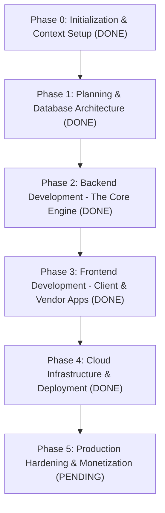

# PROJECT KNOWLEDGE BASE & MEMORY BANK

---

## 1. Executive Summary & Business Context

We are building a scalable, high-performance Online Travel Agency (**OTA**) platform targeting an initial beta of 200 users, architected from the ground up for high concurrency, data integrity, and modular scalability.

### Core Value Proposition & Dual User Journey
The platform enforces a strict domain and UI/UX separation between two distinct travel booking paradigms:
1. **Hotel Reservations (Transactional / Velocity-driven):**
   * Optimized for speed, low-friction discovery, and immediate conversion.
   * Target audience: Business travelers, short city stays, transit bookings.
   * Key characteristics: Strict date-range filtering, rapid sorting (price, proximity, rating), one-click checkout.
2. **Resort Reservations (Immersive Vacation Planning + Local Guide Bundles):**
   * Rich media, amenity-focused vacation planning.
   * **Local Guide Bundling:** First-class integration allowing users to browse certified local tour guides (identity, bio, languages, hourly/daily fees, review ratings, experience highlights) and attach/bundle them directly to their resort booking reservation in a single checkout flow.

### MVP Inventory Model
* **Vendor Allocation Model:** Vendors/hosts allocate a fixed block of room inventory directly into our database (`room_allocations`). This eliminates complex, latency-heavy two-way GDS (Global Distribution System) real-time syncing for the MVP phase while ensuring zero overbooking via strict database-level transactional concurrency (`SELECT ... FOR UPDATE` with `CHECK (booked_count <= total_allocated)`).

### Interfaces & Target Personas
1. **Consumer Mobile Application (Cross-Platform / Flutter):** Dual-path search (Hotels vs. Resorts), Mapbox interactive map explorer, guide bundling interface, checkout & reservation tracking.
2. **Vendor Management Portal (Web):** Inventory allocation matrix, pricing rules, guide profile management, booking reconciliation.
3. **Internal Admin Dashboard (Web):** User management, platform fee configuration, vendor vetting/approvals, guide certification oversight, system telemetry.

---

## 2. Technology Stack & Technical Constraints

| Layer | Technology | Rationale & Architectural Choice |
| :--- | :--- | :--- |
| **Backend Framework** | Python 3.11+ / FastAPI | High asynchronous throughput (ASGI / `uvloop`), native Pydantic v2 validation, auto-generating OpenAPI schemas. |
| **Database** | PostgreSQL 15+ | Strict relational constraints, robust ACID transactional guarantees for booking locks, spatial query readiness. |
| **ORM / Migrations** | SQLAlchemy 2.0 (Async) + Alembic | Modern async I/O database communication, strict typed models, deterministic schema migrations. |
| **Mapping Engine** | Mapbox GL SDK / Mapbox APIs | Cost-effective vector tiles, smooth 60fps mobile rendering, custom markers for hotels vs. resorts & guide hotspots. |
| **Client Frontend** | Flutter (Dart) | Single codebase for native iOS/Android performance, custom rendering engine for smooth split-flow UX. |
| **Vendor/Admin Web** | Modern Lightweight Web (HTML5/Tailwind/ES6) | Fast responsive data grids, inventory management tables, analytics views. |
| **Container & Infra** | Docker, Docker Compose, Nginx, Linux | Repeatable environments, isolated service boundaries, zero-drift local-to-production deployment. |

---

## 3. Project Roadmap & Sequential Phasing Tracker

### Current Phase: **Phase 5: Production Hardening & Monetization**



| Phase | Description | Deliverables | Status |
| :--- | :--- | :--- | :--- |
| **Phase 0** | **Initialization & Context Setup** | Context Memory Bank (`PROJECT_KNOWLEDGE.md`), project standards, tech stack alignment. | **COMPLETED** |
| **Phase 1** | **Planning & Database Architecture** | Entity-Relationship (ER) design, PostgreSQL schema (raw SQL + SQLAlchemy 2.0 models), indexes, transactional lock design, seed data. | **COMPLETED** |
| **Phase 2** | **Backend Development (The Core Engine)** | FastAPI modular app, separated Hotel vs. Resort query pipelines, Guide Bundling engine, Allocation inventory locks, 100% passing test suite. | **COMPLETED** |
| **Phase 3** | **Frontend Development (Client & Web)** | Mobile UI (Flutter), dual-path search UI, Mapbox integration, Vendor/Admin portal interfaces. | **COMPLETED** |
| **Phase 4** | **Cloud Infrastructure & Deployment** | Multi-stage Dockerfiles, Docker Compose orchestrations, `.env` config templates, deployment scripts. | **COMPLETED** |
| **Phase 5** | **Production Hardening & Monetization** | Stripe payments, transactional emails, Alembic DB migrations, security lockdown (CORS, Secrets), and Consumer 'My Trips' wiring. | **PENDING** |

---

## 4. Architectural Decision Records (ADRs)

### ADR-001: Dual-Pipeline Domain Separation (Hotels vs. Resorts)
* **Status:** Accepted
* **Decision:** Implement dedicated domain services and query pipelines (`HotelService` vs. `ResortService`) sharing core inventory/booking primitives but maintaining decoupled presentation and aggregation layers.

### ADR-002: Vendor Room Allocation Model for MVP
* **Status:** Accepted
* **Decision:** Implement an allocation inventory model where partner properties assign fixed room quotas to our platform. Inventory deduction utilizes database row-level locking (`SELECT ... FOR UPDATE`) or atomic decrement constraints to guarantee zero overbooking during concurrent booking spikes.

### ADR-003: Mapbox for Spatial Rendering & Geocoding
* **Status:** Accepted
* **Decision:** Standardize on Mapbox SDKs for vector tile map displays, custom property pin clustering, and bounding-box queries (`min_lat`, `max_lat`, `min_lon`, `max_lon`).

### ADR-004: Async FastAPI + PostgreSQL Stack
* **Status:** Accepted
* **Decision:** Python FastAPI with async SQLAlchemy against PostgreSQL. Leverages connection pooling, non-blocking I/O for external integrations, and strict relational foreign keys/check constraints.

### ADR-005: Persistent Context Retention via `PROJECT_KNOWLEDGE.md`
* **Status:** Accepted
* **Decision:** Maintain `PROJECT_KNOWLEDGE.md` as the single source of truth (SSOT). Every phase boundary strictly requires synchronizing completed deliverables, next steps, and ADRs.

### ADR-006: Composite Reservation Model with Bundled Guide Items
* **Status:** Accepted
* **Decision:** Model bookings with a parent `reservations` table and child line items: `room_booking_items` and `guide_booking_items`. The parent reservation holds overall financial aggregates, state machine transitions, and idempotency locks.

### ADR-007: Pessimistic Row-Level Locking on Allocation & Guide Calendars
* **Status:** Accepted
* **Decision:** Execute booking operations inside an explicit database transaction using `SELECT FOR UPDATE` on `room_allocations` and `guide_availabilities`. Database check constraints (`booked_count <= total_allocated`) act as safety nets.

### ADR-008: Dual-Pipeline REST API Implementation
* **Status:** Accepted
* **Decision:** Expose `/api/v1/hotels` for rapid geo-proximity/price sorting and `/api/v1/resorts` for experiential search with preloaded certified guide rosters.

### ADR-009: Pre-Checkout Quote and Atomic Allocation Checkout
* **Status:** Accepted
* **Decision:** Implement `/api/v1/bookings/quote` for real-time price estimation (rooms + guide + 5% platform fee + 8.5% lodging tax) prior to executing `/api/v1/bookings` transactional commitment.

### ADR-010: Client-Side Dual-Path Segmented Journey Navigation
* **Status:** Accepted
* **Decision:** The consumer Flutter mobile application enforces a persistent segmented control separating the **City Hotels** journey (fast transactional discovery with Mapbox list/map toggle) from the **Resorts & Guides** journey (curated luxury imagery, experience filters, and resident guide rosters).

### ADR-011: Modal Sheet & Roster UI for Local Guide Bundling
* **Status:** Accepted
* **Decision:** Resort detail views display certified resident tour guides with 1-tap bundle selection. Guide cards provide interactive modals (`GuideBundleSheet`) displaying credentials, spoken languages, specialties, daily rates, and verified badges.

### ADR-012: Multi-Container Micro-Architecture via Docker Compose
* **Status:** Accepted
* **Decision:** Containerize the ecosystem into dedicated, decoupled services: `db` (PostgreSQL 15 with healthcheck and automatic schema/seed bootstrapping), `api` (multi-stage non-root FastAPI image), and `web` (Nginx reverse proxy and static portal web server).

---

## 5. Complete Milestone Checklist & Verification

- [x] **Phase 0:** Context Memory Bank (`PROJECT_KNOWLEDGE.md`) established.
- [x] **Phase 1:** Relational PostgreSQL DDL, Mermaid ER diagrams, and SQLAlchemy 2.0 Async declarative models created.
- [x] **Phase 2:** Asynchronous FastAPI backend engine, separated Hotel/Resort search pipelines, Guide Bundling engine, row-level allocation locking, and 100% passing Pytest suite (10/10 tests).
- [x] **Phase 3:** Flutter mobile app (Dual-path search, Mapbox integration, Guide Bundling sheet, Composite checkout), Vendor Allocation portal, and Admin Operations dashboard.
- [x] **Phase 4:** Multi-stage `Dockerfile`, Nginx reverse proxy config, `docker-compose.yml`, `.env.example`, and one-click `deploy.sh` script verified.
- [ ] **Phase 5.1:** **Financial Engine:** Integrate Stripe Payment Intents for real billing and refund processing.
- [ ] **Phase 5.2:** **Consumer Portal:** Wire up the "My Trips" dashboard to fetch live user reservations.
- [ ] **Phase 5.3:** **Automated Communications:** Implement Transactional Emails/SMS for booking confirmations (SendGrid/AWS SES).
- [ ] **Phase 5.4:** **Security Lockdown:** Remove hardcoded JWT secrets, restrict CORS to known domains, and implement API rate limiting.
- [ ] **Phase 5.5:** **Database Scalability:** Integrate Alembic for schema migrations, add Foreign Key indexes, and add pagination (limit/offset) to all list endpoints.


---

## 6. Operational Runbook & Developer Quickstart

### A. One-Click Bootstrap
```bash
chmod +x deploy.sh
./deploy.sh
```

### B. Manual Local Execution
```bash
# 1. Run Backend Engine
cd backend
uvicorn app.main:app --reload --port 8000

# 2. Run Test Suite
python3 -m pytest tests -v

# 3. Run Mobile App
cd mobile_app
flutter run
```

### C. Service Directory & Live Browser Routes
* 🌐 **Master Unified Launchpad Hub:** `http://localhost:8000/`
* 📱 **Traveler Experience (Consumer App):** `http://localhost:8000/consumer`
* 🏨 **Vendor Management Portal:** `http://localhost:8000/vendor`
* 🛡️ **Internal Admin Operations Dashboard:** `http://localhost:8000/admin`
* 📖 **Interactive Swagger / OpenAPI Specs:** `http://localhost:8000/api/v1/docs`
* 📱 **Native Flutter Mobile App:** `cd mobile_app && flutter run`
