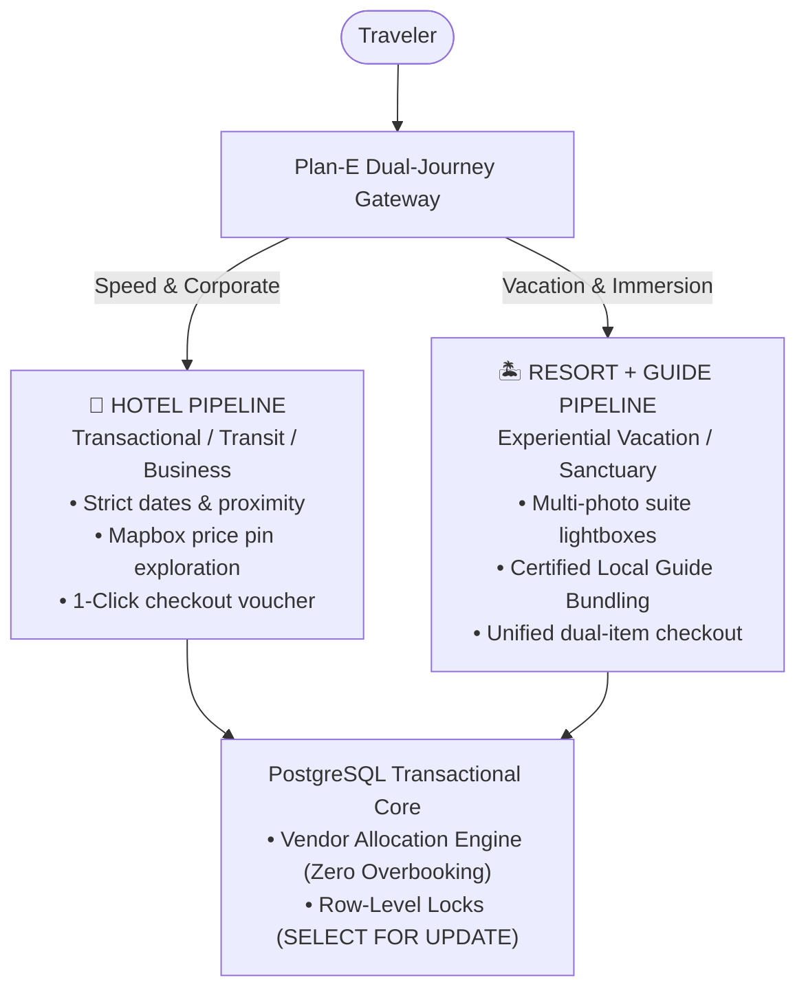
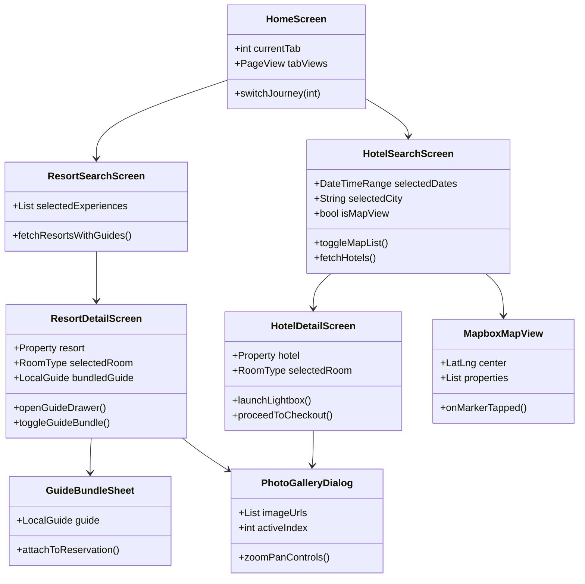
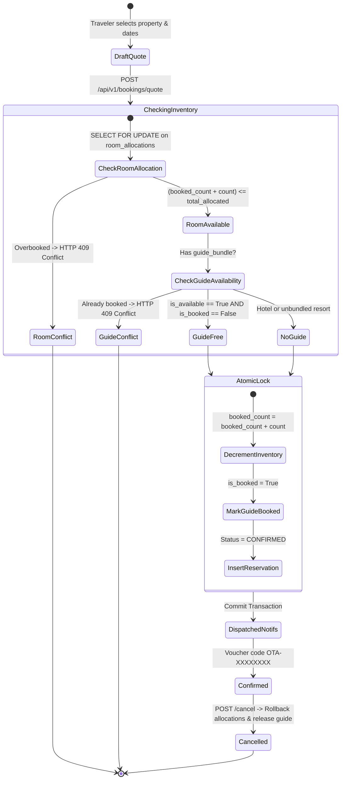
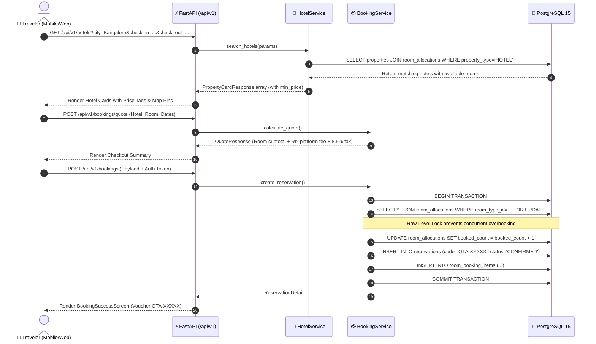
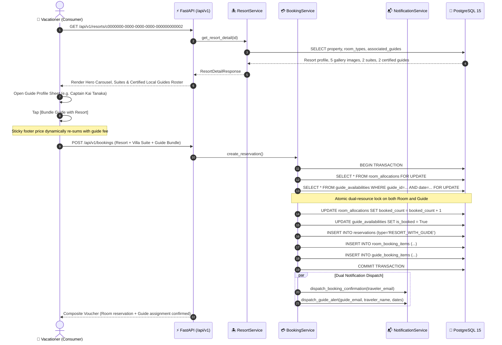
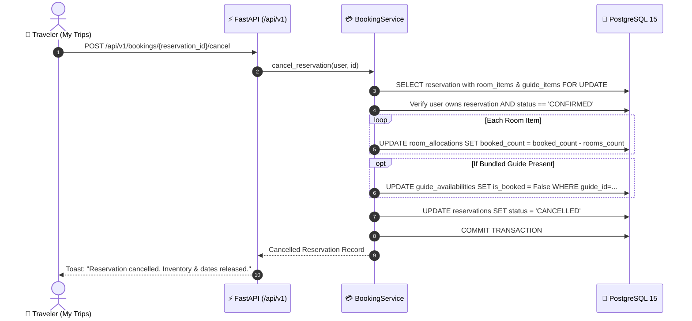

# Plan-E: Comprehensive End-to-End Product & Technical Requirements Specification

**Project Name:** Plan-E (Hyper-Local Dual-Journey Online Travel Agency)  
**Target Milestone:** Initial Production Beta (200 Active Users)  
**Document Status:** Approved, Production-Ready & Baseline  
**Document Version:** 2.0.0  
**Storage Location:** `/home/chakma-s/Desktop/Plan-E/REQUIREMENTS.md`  

---

## 1. Executive Summary & Core Business Strategy

Plan-E is a high-performance Online Travel Agency (**OTA**) designed to acquire its initial 200 users by solving the user-experience fatigue of legacy booking aggregators.



### 1.1 The Dual-Journey Distinction
* **The Hotel Flow (Transactional / Velocity-Driven):**  
  Built for corporate travelers, weekend transit guests, and urgent accommodation needs. Features rapid date filtering, location/geo-bounding queries, Mapbox interactive price markers, and a streamlined single-click checkout flow.
* **The Resort + Guide Bundle Flow (Immersive / Vacation Planning):**  
  Built for vacationers, couples, and eco-tourists. Features high-definition media, room suite exploration (villas, suites) with dedicated photo galleries, and Plan-E's core differentiator: **Local Guide Bundling**—allowing travelers to attach certified resident tour guides (scuba instructors, heritage storytellers, naturalist trek leads) directly to their resort reservation with unified pricing.

### 1.2 The Vendor Room Allocation Model (MVP)
* Bypasses heavy, latency-prone, two-way Global Distribution System (GDS) or Property Management System (PMS) integrations.
* Partner property hosts directly allocate fixed room quotas into the platform database (`room_allocations`).
* Strict database kernel-level concurrency (`SELECT ... FOR UPDATE` with `CHECK (booked_count <= total_allocated)`) mathematically guarantees **zero overbooking**.

---

## 2. System Architecture & End-to-End Infrastructure

```mermaid
flowchart TB
    subgraph ClientLayer ["Client & Interface Layer"]
        MobileApp["📱 Flutter Mobile App<br/>(iOS, Android, Chrome Web, Linux Desktop)<br/>Port: Flutter Engine / 8000"]
        ConsumerWeb["🌐 Consumer Web App<br/>http://localhost/consumer/"]
        VendorPortal["🏨 Vendor Management Portal<br/>http://localhost/vendor/"]
        AdminPortal["🛡️ Admin Governance Dashboard<br/>http://localhost/admin/"]
    end

    subgraph ProxyLayer ["Nginx Ingress & Gateway (Port 80)"]
        Nginx["plane_web_proxy (Nginx:alpine)<br/>• Static HTML5/ES6 Portal Hosting<br/>• Reverse Proxy /api/v1 -> api:8000<br/>• Gzip compression & security headers"]
    end

    subgraph BackendLayer ["Backend Application Layer (Port 8000)"]
        FastAPI["plane_api (FastAPI / Python 3.11-slim)<br/>• Async ASGI (uvloop / uvicorn)<br/>• Pydantic v2 validation<br/>• Rate limiting & security middleware<br/>• Regional policy & tax compliance"]
        
        subgraph DomainServices ["Domain Service Engines"]
            HotelSvc["HotelService (Geo & Proximity Search)"]
            ResortSvc["ResortService (Media & Guide Previews)"]
            BookingSvc["BookingService (Atomic Checkout & Row Locks)"]
            VendorSvc["VendorService (Allocation Matrix & Roster)"]
            GuideSvc["GuideService (Roster & Availability Calendars)"]
            NotifSvc["NotificationService (Email & SMS Alerts)"]
        end
    end

    subgraph DataLayer ["Persistence & Storage Layer (Port 5432)"]
        Postgres["plane_postgres (PostgreSQL 15-alpine)<br/>• ACID Transactions & Row-Level Locks<br/>• Check Constraints & Unique Indexes<br/>• Persistent Docker Volume: postgres_data"]
    end

    ClientLayer -->|Port 80 / 8000| Nginx
    Nginx -->|/api/v1 Proxy| FastAPI
    FastAPI --> DomainServices
    DomainServices -->|Asyncpg / SQLAlchemy 2.0 Pool| Postgres
```



### Component Resource Allocations
* **Total Ecosystem Footprint:** ~350 MB RAM (ideal for resource-constrained Linux host environments).
* **`plane_postgres`**: ~45 MB RAM idle; PostgreSQL 15 with tuned connection pooling (`pool_size=20`, `max_overflow=10`).
* **`plane_api`**: ~180 MB RAM; FastAPI ASGI worker running on Uvicorn.
* **`plane_web_proxy`**: ~15 MB RAM; Nginx Alpine reverse proxy and static asset server.
* **`mobile_app` (Simulation)**: ~250 MB RAM when run as Flutter Web in Chrome (`flutter run -d chrome`).

---

## 3. Detailed Component Directory: What Each Component Does

### 3.1 Mobile Client Components (`mobile_app/lib/`)



| Component | File Path | Role & Operational Responsibility |
| :--- | :--- | :--- |
| **`PlanETravelApp`** | [`main.dart`](file:///home/chakma-s/Desktop/Plan-E/mobile_app/lib/main.dart) | Application root. Injects global `AppState` via Provider, applies `AppTheme`, and wraps the desktop web viewport in a simulated 430px mobile canvas (`LayoutBuilder`). |
| **`AppState`** | [`app_state.dart`](file:///home/chakma-s/Desktop/Plan-E/mobile_app/lib/providers/app_state.dart) | Global reactive state manager. Stores current user session, auth token, active travel journey (`hotel` vs. `resort`), cart/quote drafts, and active reservations. |
| **`HomeScreen`** | [`home_screen.dart`](file:///home/chakma-s/Desktop/Plan-E/mobile_app/lib/screens/home_screen.dart) | Root consumer layout. Hosts the bottom navigation bar (`Hotels`, `Resorts`, `My Trips`, `Profile`) and persistent top segmented journey controller. |
| **`HotelSearchScreen`** | [`hotel_search_screen.dart`](file:///home/chakma-s/Desktop/Plan-E/mobile_app/lib/screens/hotel_search_screen.dart) | High-velocity hotel discovery screen. Houses city query input, date range picker, guest count selector, skeleton shimmer cards, and floating Map/List switcher. |
| **`ResortSearchScreen`** | [`resort_search_screen.dart`](file:///home/chakma-s/Desktop/Plan-E/mobile_app/lib/screens/resort_search_screen.dart) | Vacation sanctuary discovery screen. Displays curated luxury imagery, experiential filter pills (Beachfront, Wellness, Eco-tour, Scuba), and preloaded guide counts. |
| **`HotelDetailScreen`** | [`hotel_detail_screen.dart`](file:///home/chakma-s/Desktop/Plan-E/mobile_app/lib/screens/hotel_detail_screen.dart) | Transit property detail view. Features hero image, sliver app bar, amenity grid, room-type selector with bed configs, and sticky bottom booking bar. |
| **`ResortDetailScreen`** | [`resort_detail_screen.dart`](file:///home/chakma-s/Desktop/Plan-E/mobile_app/lib/screens/resort_detail_screen.dart) | Resort showcase view. Includes multi-photo hero ribbon, interactive room suite cards with dedicated photo galleries, and the **Certified Local Guides Roster**. |
| **`GuideBundleSheet`** | [`guide_bundle_sheet.dart`](file:///home/chakma-s/Desktop/Plan-E/mobile_app/lib/widgets/guide_bundle_sheet.dart) | Bottom modal displaying full guide credentials (photo, bio, spoken languages, daily/hourly rates, specialties, star rating) with 1-tap `[Bundle Guide]` button. |
| **`PhotoGalleryDialog`** | [`photo_gallery_dialog.dart`](file:///home/chakma-s/Desktop/Plan-E/mobile_app/lib/widgets/photo_gallery_dialog.dart) | Full-screen interactive lightbox. Features pinch-to-zoom (`InteractiveViewer`), swipe navigation, photo counter badge (`3 / 8`), and bottom thumbnail ribbon. |
| **`MapboxMapView`** | [`mapbox_map_view.dart`](file:///home/chakma-s/Desktop/Plan-E/mobile_app/lib/widgets/mapbox_map_view.dart) | Interactive vector map widget. Renders custom price marker pins, clusters, bounding-box updates, and click-to-preview property cards. |
| **`CheckoutScreen`** | [`checkout_screen.dart`](file:///home/chakma-s/Desktop/Plan-E/mobile_app/lib/screens/checkout_screen.dart) | Final composite reservation screen. Renders itemized cost summary (Room + Guide fee + 5% platform fee + 8.5% lodging tax), guest form, and instant confirmation button. |
| **`BookingSuccessScreen`** | [`booking_success_screen.dart`](file:///home/chakma-s/Desktop/Plan-E/mobile_app/lib/screens/booking_success_screen.dart) | Confirmation receipt screen. Renders checkmark animation, reservation code (`OTA-XXXXXXXX`), check-in instructions, and shortcut to "My Trips". |
| **`MyTripsScreen`** | [`my_trips_screen.dart`](file:///home/chakma-s/Desktop/Plan-E/mobile_app/lib/screens/my_trips_screen.dart) | Traveler reservation hub. Lists active and past trips, renders printable vouchers, and triggers 1-click cancellation with automated inventory release. |
| **`AuthBottomSheet`** | [`auth_bottom_sheet.dart`](file:///home/chakma-s/Desktop/Plan-E/mobile_app/lib/widgets/auth_bottom_sheet.dart) | Lightweight modal sheet for traveler login and registration with quick 1-click test credentials. |

---

### 3.2 Web Portal Components (`web_portal/`)

| Portal | File Path | Role & Operational Responsibility |
| :--- | :--- | :--- |
| **Consumer Web Portal** | [`consumer/index.html`](file:///home/chakma-s/Desktop/Plan-E/web_portal/consumer/index.html) | Single-page responsive consumer application. Replicates the Flutter mobile flows in standard web browsers: dual journey tabs, Leaflet/CartoDB map integration, Destination & Room Explorer modal, guide drawer, and "My Trips" voucher viewer. |
| **Vendor Management Portal** | [`vendor/index.html`](file:///home/chakma-s/Desktop/Plan-E/web_portal/vendor/index.html) | Self-service host control console: <br/>• **Allocation Matrix:** Live 7-day quota table showing total allocated, booked rooms, free units, and pricing multipliers.<br/>• **Managed Properties:** Grid of owned hotels/resorts with live status pills, GPS coordinate badges, room count, and `+ Add Hotel` / `+ Add Resort` modals.<br/>• **Guide Roster Linker:** Full CRUD for certified tour guides with `+ Register Guide`, `Edit`, `Delete`, and resort linking.<br/>• **1-Click Fast Presets:** Pre-fills City Hotel, Beach Resort, Eco Sanctuary, Heritage Hotel, and guide profiles. |
| **Admin Operations Portal** | [`admin/index.html`](file:///home/chakma-s/Desktop/Plan-E/web_portal/admin/index.html) | Internal operational oversight console: Platform metrics (total users, hotels, resorts, active guides, total volume), vendor vetting, guide verification status, system telemetry, and GDPR compliance request processing. |

---

### 3.3 Backend Routers & Services (`backend/app/`)

| Module | File Path | Role & Operational Responsibility |
| :--- | :--- | :--- |
| **`hotels` Endpoint** | [`endpoints/hotels.py`](file:///home/chakma-s/Desktop/Plan-E/backend/app/api/v1/endpoints/hotels.py) | Handles `/api/v1/hotels`. Executes geo-bounding box filtering (`min_lat`, `max_lat`, `min_lon`, `max_lon`), city search, date availability verification, and dynamic card pricing. |
| **`resorts` Endpoint** | [`endpoints/resorts.py`](file:///home/chakma-s/Desktop/Plan-E/backend/app/api/v1/endpoints/resorts.py) | Handles `/api/v1/resorts`. Delivers rich resort profiles, room suite arrays with gallery images, and preloads associated certified guide rosters. |
| **`guides` Endpoint** | [`endpoints/guides.py`](file:///home/chakma-s/Desktop/Plan-E/backend/app/api/v1/endpoints/guides.py) | Handles `/api/v1/guides`. Full CRUD: lists guides with specialty/language filters, registers new guides (`POST`), updates profile/resort links (`PATCH`), and deletes guides with availability cleanup (`DELETE`). |
| **`bookings` Endpoint** | [`endpoints/bookings.py`](file:///home/chakma-s/Desktop/Plan-E/backend/app/api/v1/endpoints/bookings.py) | Handles `/api/v1/bookings`. Produces pre-checkout quotes (`/quote`), commits atomic reservations (`POST`), lists traveler trips (`/my-reservations`), and cancels bookings (`/{id}/cancel`). |
| **`vendor` Endpoint** | [`endpoints/vendor.py`](file:///home/chakma-s/Desktop/Plan-E/backend/app/api/v1/endpoints/vendor.py) | Handles `/api/v1/vendor`. Property CRUD, room type CRUD, batch allocation creation (`/allocations/batch`), and resort-guide link associations. |
| **`BookingService`** | [`booking_service.py`](file:///home/chakma-s/Desktop/Plan-E/backend/app/services/booking_service.py) | Transactional booking orchestrator. Executes row-level locks (`SELECT FOR UPDATE`) on allocations and guide calendars, verifies capacity, generates reservation codes, and triggers notifications. |
| **`HotelService`** | [`hotel_service.py`](file:///home/chakma-s/Desktop/Plan-E/backend/app/services/hotel_service.py) | Query engine optimized for transactional speed, geographic proximity, price sorting, and room allocation checks. |
| **`ResortService`** | [`resort_service.py`](file:///home/chakma-s/Desktop/Plan-E/backend/app/services/resort_service.py) | Experiential query engine. Aggregates multi-image galleries, room suites, and associated certified guide rosters. |
| **`NotificationService`** | [`notification_service.py`](file:///home/chakma-s/Desktop/Plan-E/backend/app/services/notification_service.py) | Dispatches automated booking confirmations, cancellation alerts, host notices, and guide booking assignments. |

---

## 4. Business Logic Conditions & Concurrency Rules



### Condition 1: Zero-Overbooking Room Allocation Math
1. **Locking Mechanism:** During checkout execution, the system issues:
   ```sql
   SELECT id, total_allocated, booked_count, rate_multiplier, is_closed
   FROM room_allocations
   WHERE room_type_id = :room_type_id
     AND allocation_date BETWEEN :check_in AND :last_night
   FOR UPDATE;
   ```
2. **Availability Check:**
   $$\forall \text{ date } \in [\text{check\_in}, \text{check\_out}): (\text{booked\_count} + \text{requested\_rooms}) \le \text{total\_allocated} \quad \text{AND} \quad \text{is\_closed} = \text{False}$$
3. **Violation Handling:** If any date has insufficient allocation or `is_closed == True`, transaction aborts immediately with:
   * **Status Code:** `409 Conflict`
   * **Payload:** `{"detail": "Room inventory unavailable for the selected dates."}`
4. **Safety Net:** PostgreSQL table constraint: `CHECK (booked_count <= total_allocated)`.

### Condition 2: Local Guide Bundling Eligibility & Collision Prevention
1. **Guide Verification:** Guide must have `is_active == True` and `is_verified == True`.
2. **Resort Association:** Guide must have an active record in `resort_guide_associations` for target `resort_id`.
3. **Date Alignment:** Guide's `service_date` must satisfy:
   $$\text{check\_in\_date} \le \text{service\_date} < \text{check\_out\_date}$$
4. **Availability Lock:** System locks the guide's calendar row:
   ```sql
   SELECT id, is_available, is_booked
   FROM guide_availabilities
   WHERE guide_id = :guide_id AND availability_date = :service_date
   FOR UPDATE;
   ```
5. **Collision Check:** Must satisfy `is_available == True AND is_booked == False`. If already booked, transaction rolls back with `409 Conflict` (`"Selected guide is already booked on this date."`).

### Condition 3: Unified Composite Pricing Formula
The checkout quote computes financial line items with deterministic rounding:
$$\text{Room Subtotal} = \sum_{d = \text{check\_in}}^{\text{last\_night}} \left( \text{Base Price} \times \text{Rate Multiplier}_d \times \text{Rooms Count} \right)$$
$$\text{Guide Subtotal} = \begin{cases} \text{Guide Daily Rate} \times \text{Duration Days}, & \text{if guide bundled} \\ 0, & \text{otherwise} \end{cases}$$
$$\text{Platform Fee} = \text{Round}\Big((\text{Room Subtotal} + \text{Guide Subtotal}) \times 0.05, \, 2\Big) \quad (5\%)$$
$$\text{Lodging Tax} = \text{Round}\Big((\text{Room Subtotal} + \text{Guide Subtotal}) \times 0.085, \, 2\Big) \quad (8.5\%)$$
$$\text{Total Amount} = \text{Room Subtotal} + \text{Guide Subtotal} + \text{Platform Fee} + \text{Lodging Tax}$$

### Condition 4: Reservation Cancellation & Automatic Inventory Release
1. **Eligibility:** Reservation must have `status == 'CONFIRMED'`. Authenticated user must own the reservation (`user_id == current_user.id`) or hold `role == 'ADMIN'`.
2. **Atomic Inventory Reversion:**
   * For each room booking item:
     $$\text{booked\_count} = \max(0, \text{booked\_count} - \text{rooms\_count})$$
   * For attached guide item:
     $$\text{is\_booked} = \text{False}$$
   * Reservation state transitions:
     $$\text{status} = \text{'CANCELLED'}$$
3. **Statutory Cooling-Off Policy:**
   * **Hotels:** Free 100% cancellation up to 24 hours prior to check-in date.
   * **Resorts:** Free 100% cancellation up to 5 days prior to check-in date (due to resort staffing and guide scheduling).

### Condition 5: Vendor Multi-Tenant Ownership Isolation
* All vendor mutations (`PATCH /properties/{id}`, `DELETE /properties/{id}`, `POST /rooms`, `POST /allocations/batch`) strictly verify:
  ```python
  if property_obj.vendor_id != current_vendor_profile.id:
      raise HTTPException(status_code=403, detail="Not authorized to modify this property.")
  ```

---

## 5. Design System: Colors, Typography & Visual Tokens

Plan-E employs an intentional visual hierarchy separating corporate transit velocity from vacation immersion.

```
[ Signature Color Palette ]
Primary Brand:  #7DE720  ██████████  (Neon/Lime Green - Accents, CTAs, Verified Badges)
Dark Canvas:    #0F172A  ██████████  (Slate 900 - Web Background / Simulation Frame)
Surface Dark:   #1A1A1A  ██████████  (Dark Surface / Card Containers)
Hotel Accent:   #4F46E5  ██████████  (Indigo 600 - Business Stays, City Badges)
Resort Accent:  #0D9488  ██████████  (Teal 600 - Sanctuaries, Ocean Badges)
Guide Accent:   #F59E0B  ██████████  (Amber 500 - Compass, Tour Guide Profiles)
Success:        #10B981  ██████████  (Emerald 500 - Live, Available, Confirmed)
Error / Alert:  #EF4444  ██████████  (Rose 500 - Closed, Overbooked, Cancelled)
```

### 5.1 Color Token Mapping Table

| Semantic Token | Light Mode Hex | Dark Mode Hex | Usage & Application |
| :--- | :--- | :--- | :--- |
| **`brandColor`** | `#7DE720` | `#7DE720` | Signature Neon Lime. Primary buttons, selected navigation icons, verified badges, interactive price tags. |
| **`hotelPrimary`** | `#4F46E5` (Indigo-600) | `#818CF8` (Indigo-400) | City hotel cards, hotel filter tags, hotel map pins, "+ Add Hotel" button. |
| **`hotelBg`** | `#EEF2FF` (Indigo-50) | `#1E1B4B` (Indigo-950) | Background pill for Hotel badge, hotel room suite highlight borders. |
| **`resortPrimary`** | `#0D9488` (Teal-600) | `#2DD4BF` (Teal-400) | Luxury resort cards, villa tags, resort map pins, "+ Add Resort" button. |
| **`resortBg`** | `#F0FDFA` (Teal-50) | `#134E4A` (Teal-950) | Background pill for Resort badge, experience filter chips. |
| **`guideGold`** | `#F59E0B` (Amber-500) | `#FBBF24` (Amber-400) | Local guide avatars, guide bundle badges, "+ Register Guide" buttons, star ratings. |
| **`guideBg`** | `#FFFBEB` (Amber-50) | `#78350F` (Amber-950) | Guide credentials drawer, guide specialties pill background. |
| **`surface`** | `#F8FAFC` (Slate-50) | `#1A1A1A` / `#0F172A` | Background scaffold for mobile screens and web pages. |
| **`cardBg`** | `#FFFFFF` (White) | `#121212` / `#1E293B` | Property cards, room suite containers, allocation matrix tables. |
| **`textPrimary`** | `#0F172A` (Slate-900) | `#FFFFFF` (Pure White) | Headings, property names, bold checkout amounts. |
| **`textSecondary`** | `#64748B` (Slate-500) | `#CBD5E1` (Slate-300) | Subtitles, addresses, room descriptions, guide bios. |
| **`textMuted`** | `#94A3B8` (Slate-400) | `#64748B` (Slate-500) | Inactive labels, disabled buttons, date placeholder text. |
| **`divider`** | `#E2E8F0` (Slate-200) | `#334155` (Slate-700) | Card dividers, table borders, navigation bar top border. |
| **`statusSuccess`** | `#10B981` (Emerald-500) | `#34D399` (Emerald-400) | `OPEN` allocation pill, `Live` status badge, confirmed voucher icon. |
| **`statusDanger`** | `#EF4444` (Rose-500) | `#F87171` (Rose-400) | `CLOSED` allocation pill, `Delete` button, cancellation alert text. |

### 5.2 Visual Shapes, Radii & Elevations
* **Corner Radii:**
  * Action Buttons & Input Fields: `12px` (`rounded-xl`).
  * Property & Room Cards: `16px` (`rounded-2xl`).
  * Modals & Bottom Sheets: `24px` to `28px` top radius (`rounded-3xl`).
  * Badge Tags: `9999px` (`rounded-full`).
* **Elevations & Shadows:**
  * Low (Cards): `0 1px 3px 0 rgba(0, 0, 0, 0.1), 0 1px 2px -1px rgba(0, 0, 0, 0.1)`.
  * Elevated (Dropdowns & Popups): `0 10px 15px -3px rgba(0, 0, 0, 0.1)`.
  * Modals & Dialogs: `0 25px 50px -12px rgba(0, 0, 0, 0.25)` with `backdrop-blur-sm` (`rgba(0, 0, 0, 0.6)`).

---

## 6. UI Transitions, Animations & State Flows

| Interactive Event | Trigger / Source | Target Component | Animation Curve & Duration | Visual State Transition |
| :--- | :--- | :--- | :--- | :--- |
| **Journey Switch** | Tap Hotel/Resort pill | `HomeScreen` / Web Header | `Curves.easeInOut`, 200ms | Sliding indicator moves across pill; feed smoothly switches between transactional cards and experiential cards. |
| **Map / List Toggle** | Tap floating toggle FAB | `HotelSearchScreen` | `Curves.fastOutSlowIn`, 250ms | Feed cross-fades with Mapbox vector map; FAB icon rotates between `fa-map` and `fa-list`. |
| **Shimmer Loader** | During API query fetch | `SkeletonLoader` card | Linear continuous loop, 1200ms | 3-stop gradient (`#334155` → `#475569` → `#334155`) animates horizontally across placeholder boxes. |
| **Lightbox Zoom** | Tap property/room photo | `PhotoGalleryDialog` | Scale transition, 200ms | Photo scales up from thumbnail to full-screen viewport; `InteractiveViewer` activates pinch-to-zoom (1.0x to 4.0x). |
| **Ribbon Switch** | Tap thumbnail in ribbon | Detail Hero / Lightbox | Instant cross-fade, 120ms | Hero image replaces current frame; active thumbnail border illuminates with `#7DE720` neon green. |
| **Guide Sheet Open** | Tap guide card in roster | `GuideBundleSheet` | `Curves.easeOutQuad`, 300ms | Sheet translates up from bottom edge (`animate-slide-up`); dark backdrop fades to 60% opacity with 4px blur. |
| **Bundle Selection** | Tap `[Bundle Guide]` | Resort Detail Sticky Bar | Spring curve, 150ms | Guide card highlights with amber border; bottom sticky bar price tick-updates to include guide daily fee. |
| **Button Tap Feedback** | Mouse hover / Mobile touch | All Action Buttons | Ease, 100ms | On hover: `scale(1.02)`. On active tap: `scale(0.98)`. On loading: opacity drops to `0.5` with spinning `fa-spin` icon. |
| **Modal Dismiss** | Click `x` or outside | Modals & Auth Sheets | `Curves.easeInQuad`, 200ms | Container translates down 100px while opacity drops to 0; backdrop blur clears. |

---

## 7. End-to-End Data Flow Sequence Diagrams

### 7.1 Sequence Flow A: Fast Transactional Hotel Booking



---

### 7.2 Sequence Flow B: Experiential Resort Discovery & Guide Bundling



---

### 7.3 Sequence Flow C: Vendor Property Provisioning & Allocation Engine

```mermaid
sequenceDiagram
    autonumber
    actor Host as 🏨 Property Host (Vendor)
    participant Portal as 💻 Vendor Portal (UI)
    participant API as ⚡ FastAPI (/api/v1)
    participant DB as 🐘 PostgreSQL 15

    Host->>Portal: Click "+ Add Hotel" or "+ Add Resort" (or 1-Click Preset)
    Host->>Portal: Submit Property Form (Name, GPS Lat/Lon, Photos, Initial Room)
    Portal->>API: POST /api/v1/vendor/properties
    API->>DB: INSERT INTO properties (...)
    DB-->>API: Property ID created
    
    Portal->>API: POST /api/v1/vendor/rooms (property_id, name, base_price, capacity)
    API->>DB: INSERT INTO room_types (...)
    DB-->>API: Room Type ID created
    
    Note over Portal,API: Auto-Provisioning 365 Days of Inventory
    Portal->>API: POST /api/v1/vendor/allocations/batch (start=Today, end=Today+365, quota=10)
    API->>DB: INSERT INTO room_allocations (365 daily rows)
    DB-->>API: 365 dates provisioned
    API-->>Portal: Success alert
    Portal-->>Host: Property displays "Live" badge; immediately bookable on Mobile & Web!
```

---

### 7.4 Sequence Flow D: Trip Cancellation & Automatic Inventory Release



---

## 8. Complete REST API Specifications

### 8.1 Public Discovery Endpoints
* `GET /api/v1/hotels`: Query hotels. Params: `city`, `min_lat`, `max_lat`, `min_lon`, `max_lon`, `check_in`, `check_out`, `min_rating`, `sort_by`, `page`, `page_size`.
* `GET /api/v1/hotels/{hotel_id}`: Hotel detail including room types, amenities, photos, and location coordinates.
* `GET /api/v1/resorts`: Query vacation resorts. Returns card payload with `available_guides_count` and `featured_guides`.
* `GET /api/v1/resorts/{resort_id}`: Resort detail including luxury suites and the full `associated_guides` roster.
* `GET /api/v1/guides`: Query certified guides. Filters: `specialty`, `language`.
* `GET /api/v1/guides/{guide_id}`: Full guide profile with credentials, rating, and availability calendar.

### 8.2 Booking & Reservation Endpoints
* `POST /api/v1/bookings/quote`: Pre-checkout quote generator. Returns itemized price calculation without database writes.
* `POST /api/v1/bookings`: Atomic reservation creation with row-level allocation locking. Returns confirmed `OTA-XXXXXXXX` reservation.
* `GET /api/v1/bookings/my-reservations`: Authenticated traveler trips dashboard.
* `GET /api/v1/bookings/{reservation_id}`: Single reservation voucher lookup.
* `POST /api/v1/bookings/{reservation_id}/cancel`: Traveler cancellation endpoint; triggers atomic inventory release and notifications.

### 8.3 Vendor Operations Endpoints
* `GET /api/v1/vendor/properties`: Lists all properties owned by authenticated vendor with room suites and status.
* `POST /api/v1/vendor/properties`: Creates new hotel or resort listing.
* `PATCH /api/v1/vendor/properties/{property_id}`: Updates property metadata, coordinates, photos, amenities.
* `DELETE /api/v1/vendor/properties/{property_id}`: Unpublishes and deletes property.
* `POST /api/v1/vendor/rooms`: Adds room suite to owned property.
* `DELETE /api/v1/vendor/rooms/{room_id}`: Removes room suite.
* `GET /api/v1/vendor/allocations`: Fetches daily room allocation rows for date range (`room_type_id`, `start_date`, `end_date`).
* `POST /api/v1/vendor/allocations/batch`: Bulk sets room quotas and rate multipliers across date range.
* `POST /api/v1/guides`: Registers new certified local guide.
* `PATCH /api/v1/guides/{guide_id}`: Updates guide profile, rates, languages, and linked resort.
* `DELETE /api/v1/guides/{guide_id}`: Deletes guide and cleans up resort associations.
* `POST /api/v1/vendor/resorts/{resort_id}/guides/{guide_id}`: Associates local guide to resort roster.

---

## 9. Non-Functional Requirements & Performance SLAs

| Metric | Target SLA | Verification Method |
| :--- | :--- | :--- |
| **Zero Overbooking** | 100% Guaranteed | Verified via high-concurrency automated test (`test_allocation_overbooking_prevention`). Concurrent checkouts on last available room return 1 success (201) and $N-1$ conflicts (409). |
| **Search Latency** | P95 < 150ms | Measured on `/api/v1/hotels` and `/api/v1/resorts` under 50 req/sec load with spatial index bounding. |
| **Booking Latency** | P95 < 300ms | End-to-end transactional execution (locks + inserts + response generation). |
| **Container Memory** | $\le$ 350 MB Total | Docker Compose stack (`plane_postgres` + `plane_api` + `plane_web_proxy`) verified via `docker stats`. |
| **Client Rendering** | 60 FPS | Flutter custom sliver and map view rendering; zero frame drops on mobile and web viewports. |
| **Test Suite Health** | 100% Passing | Continuous verification via `pytest tests -v` (10/10 tests green). |

---

## 10. Execution Roadmap & Verification Checklist

- [x] **Phase 0:** Context Memory Bank established (`PROJECT_KNOWLEDGE.md`, `master_prompt`).
- [x] **Phase 1:** Relational PostgreSQL schema, UUID primary keys, check constraints, and seed data.
- [x] **Phase 2:** Asynchronous FastAPI backend engine, separated query pipelines, guide bundling, and row-level locking.
- [x] **Phase 3:** Flutter mobile app (Dual-path search, Mapbox view, Guide sheet), Vendor Portal, Admin Portal.
- [x] **Phase 4:** Docker Compose orchestration, Nginx reverse proxy, multi-stage Dockerfiles.
- [x] **Phase 5.1:** Complete Guide CRUD (Create, Edit, Delete) with resort linking in the Vendor Portal.
- [x] **Phase 5.2:** Vendor Allocation Matrix URL fix (relative/absolute API_BASE compatibility).
- [x] **Phase 5.3:** Traveler "My Trips" voucher dashboard with instant cancellation and inventory release.
- [x] **Phase 5.4:** Automated multi-recipient notifications (Traveler, Host, and Guide alerts).
- [x] **Phase 5.5:** Security hardening: sliding-window IP rate limiting, CORS whitelist, security HTTP headers.
- [x] **Phase 5.6:** Global compliance: dynamic regional tax, statutory cooling-off cancellation windows, GDPR export/anonymization.
