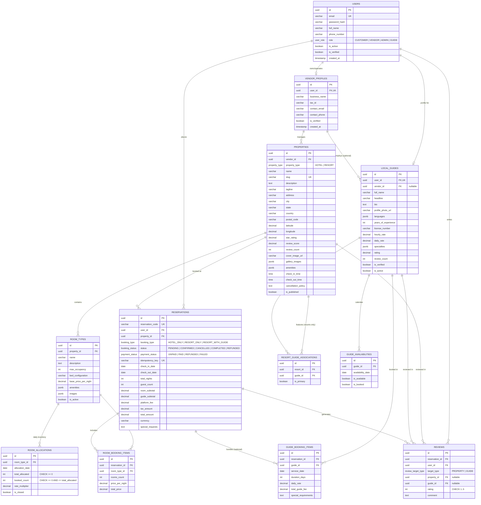

# Plan-E: Entity-Relationship Architecture & Data Dictionary

## 1. Domain ER Diagram (Mermaid)



---

## 2. Core Architectural Guarantees & Transaction Lifecycle

### A. The Allocation Model & Atomic Overbooking Prevention
To guarantee zero overbooking during concurrent booking spikes under the Vendor Allocation model:
1. Every night of a guest's stay maps to a row in `room_allocations`.
2. When creating a reservation, the transaction performs:
   ```sql
   -- Pessimistic Lock & Availability Verification
   SELECT id, total_allocated, booked_count 
   FROM room_allocations
   WHERE room_type_id = :room_type_id 
     AND allocation_date >= :check_in 
     AND allocation_date < :check_out
     AND is_closed = FALSE
   FOR UPDATE;
   ```
3. If `(booked_count + :requested_rooms) <= total_allocated` across all stay dates:
   ```sql
   UPDATE room_allocations
   SET booked_count = booked_count + :requested_rooms
   WHERE room_type_id = :room_type_id
     AND allocation_date >= :check_in
     AND allocation_date < :check_out;
   ```
4. Database-level `CHECK (booked_count <= total_allocated)` provides a secondary hard barrier against race conditions.

### B. Resort & Local Guide Bundling Transaction
When a user books a Resort with a Local Guide:
1. `reservations.booking_type` is tagged as `RESORT_WITH_GUIDE`.
2. The booking engine locks both the `room_allocations` and the `guide_availabilities` for the requested date window within a single atomic database transaction.
3. `guide_availabilities.is_booked` is set to `TRUE`.
4. If either room inventory or guide availability fails, the entire transaction rolls back cleanly.

### C. Spatial Search Performance for Mapbox
- Latitude (`DECIMAL(10, 7)`) and Longitude (`DECIMAL(10, 7)`) are stored on `properties`.
- A composite B-tree index on `(latitude, longitude)` and `(property_type, latitude, longitude)` accelerates viewport bounding box queries (`lat BETWEEN min_lat AND max_lat AND lon BETWEEN min_lon AND max_lon`).
